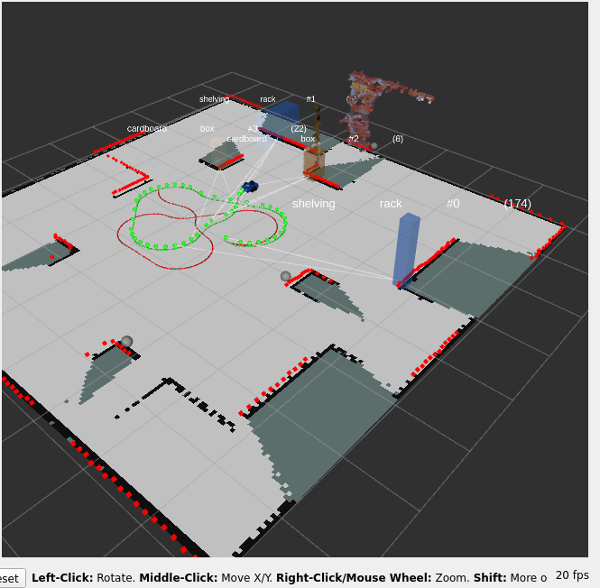
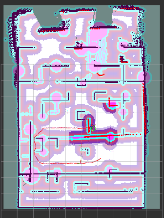
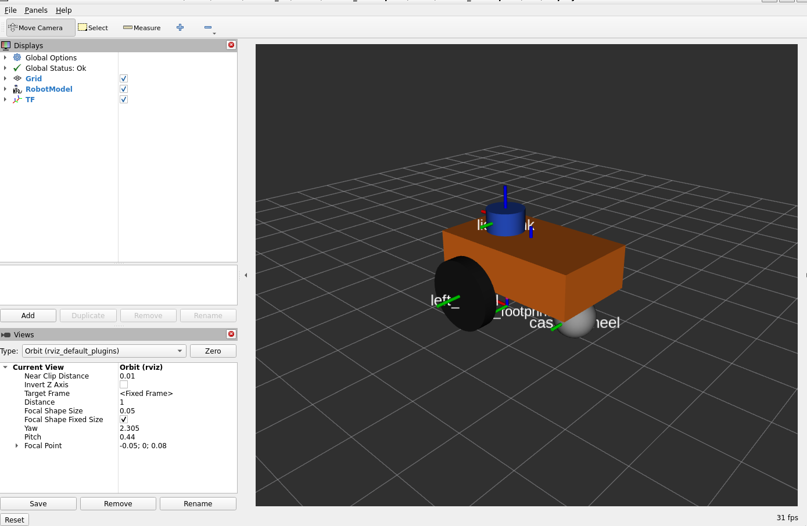
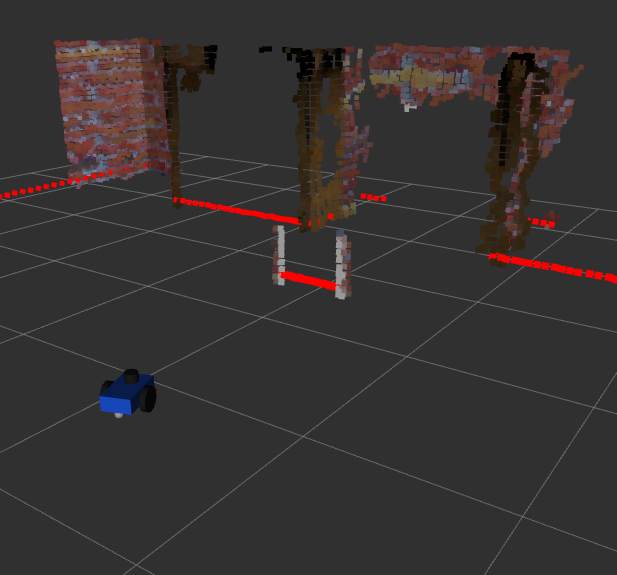
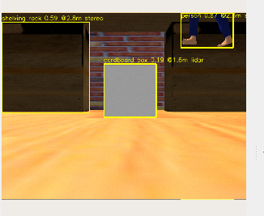
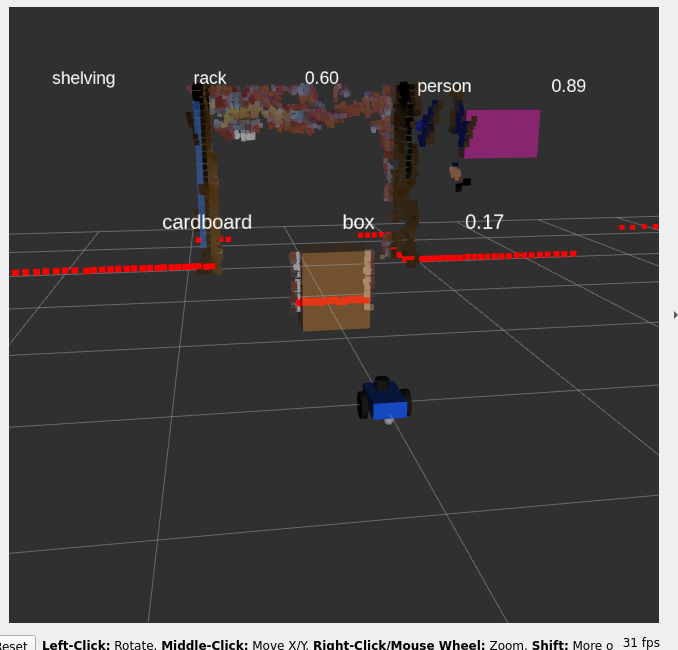
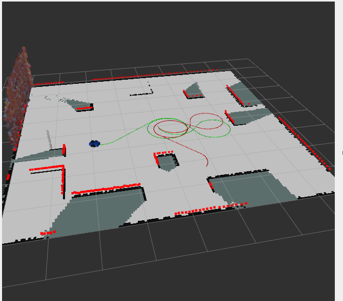

# Autonomous Differential-Drive Warehouse Robot (ROS 2 Humble)

An end-to-end autonomy stack for a small differential-drive warehouse robot, built and validated in Gazebo:
**wheel odometry → EKF sensor fusion → stereo/LiDAR perception → object-based SLAM → Nav2 navigation with a semantic costmap → automatic validation against ground truth.**

Everything runs in Docker on ROS 2 Humble, so the only host requirement is Docker.

<p align="center">
  
  
</p>

---

## Contents

1. [What it does](#what-it-does)
2. [Task brief coverage](#task-brief-coverage)
3. [Architecture](#architecture)
4. [Repository layout](#repository-layout)
5. [Quick start](#quick-start)
6. [Task 2 package: `odom_computation`](#task-2-package-odom_computation)
7. [Validation method](#validation-method)
8. [Results](#results)
9. [Known limitations](#known-limitations)
10. [Tech stack](#tech-stack)

## What it does

| Phase | Task | What was built |
|---|---|---|
| 1 | Odometry | `wheel_tick_pub` (simulated or serial encoder ticks) and `odom_calculator` (`/odom` + `odom → base_link` TF) |
| 2 | Sensors and fusion | Robot URDF with 2D LiDAR, IMU and stereo camera; `robot_localization` EKF fusing wheel speed (vx) with gyro yaw rate; `ekf_compare` tool |
| 3 | Perception | Stereo point-cloud pipeline with `cloud_filter`; YOLOv8-World `object_detector` (pallets, racks, boxes, people) giving 3D detections |
| 3 | Object-based SLAM | `slam_toolbox` for the occupancy map plus `object_slam`: a GTSAM **iSAM2 factor graph** of robot keyframes and object landmarks that publishes `map → odom` and a persistent semantic map |
| 4 | Nav2 configuration | Global and local costmaps that consume the semantic map, narrow-aisle inflation and footprint, custom behaviour tree |
| 4 | Planning and validation | A* vs Dijkstra global planner, DWB vs MPPI local planner, a walking-person dynamic obstacle, and `validate_pipeline.py`, which scores the whole pipeline against the Gazebo world file |

## Task brief coverage

The original brief (`Task_Robotics.pdf`) has two tasks. Both are covered.

| Brief requirement | Where it is met |
|---|---|
| **Task 1:** 2-wheel differential-drive robot in URDF | `src/task_robotics/urdf/task_robot.urdf.xacro` |
| LiDAR on top, IMU, wheel odometry, published on their topics | `/scan`, `/imu/data`, `/odom` via Gazebo plugins |
| Visualise sensor data in RViz | `src/task_robotics/rviz/` |
| Custom Gazebo world, robot spawned into it | `src/task_robotics/worlds/warehouse.world`, `warehouse_people.world` |
| Map the world and integrate Nav2, navigate to a goal | `slam_toolbox` map plus `nav2.launch.py`; `tools/nav_goal_test.py` |
| Obstacle avoidance during navigation | Nav2 obstacle layers, DWB/MPPI, semantic keep-out zones, walking-person test |
| **Task 2:** package `odom_computation`, node subscribing to `/left_wheel_ticks` and `/right_wheel_ticks` | `src/odom_computation` (see [below](#task-2-package-odom_computation)) |
| Publish `/odom` at 10 Hz; wheel radius 0.065 m, base 0.21 m, 512 ticks per revolution; quaternion orientation | `odom_computation/odom_node.py` |
| Bonus: `imu_publisher` on `/imu/data` | `odom_computation/imu_publisher.py` |

## Architecture

```
 Gazebo (headless)  ──►  /scan  /imu/data  /stereo/*  /odom  /clock
        │
        ├─ ekf_filter_node ───────────────► odom → base_link  (smooth odometry)
        ├─ cloud_filter ──► object_detector (YOLOv8-World) ──► /objects/detections
        ├─ slam_toolbox ──► /map, /pose  (LiDAR scan matching)
        └─ object_slam (GTSAM iSAM2) ◄── /pose + detections + odometry
                 ├─► TF map → odom
                 └─► /semantic_map/landmarks  (Detection3DArray, map frame)
                              │
                       semantic_costmap ──► class-sized keep-out PointCloud2
                              │
 Nav2:  planner_server (NavFn A* / Dijkstra) · controller_server (DWB / MPPI)
        smoother · behavior_server · bt_navigator · velocity_smoother
        costmaps = static_layer (/map) + obstacle_layer (/scan + semantic cloud) + inflation_layer
```

### Semantic costmap

`semantic_costmap` turns each landmark into a keep-out disc sized by class (rack 0.30 m, pallet 0.25 m, box 0.20 m, person 0.35 m with a 1.5 s time-to-live). A **ghost-landmark filter** drops detections with no mapped LiDAR surface within 0.20 m (pallets are exempt), so false YOLO detections cannot block an aisle.

### Narrow aisles

The 0.65 m aisle is tight for a 0.26 × 0.24 m footprint. The configuration uses an explicit footprint polygon and inflation of 0.45 m (global) and 0.35 m (local). The footprint check needs about 0.25 m of clearance from walls, leaving roughly ±7.5 cm of slack. `tools/check_aisles.py` verifies offline that each aisle is passable.

## Repository layout

```
docker/Dockerfile, docker-compose.yml     ROS 2 Humble + Gazebo + Nav2 + slam_toolbox + torch/ultralytics/gtsam
src/task_robotics/                        main stack
  task_robotics/    wheel_tick_pub, odom_calculator, cloud_filter, object_detector, object_slam,
                    slam_ops, semantic_ops, semantic_costmap, validation_ops, worker_walker
  launch/           sensors_sim.launch.py (sim + perception + SLAM), nav2.launch.py (Nav2)
  config/           ekf.yaml, slam_toolbox*.yaml, nav2_params.yaml
  behavior_trees/   warehouse_nav.xml (A*+DWB), warehouse_nav_dijkstra.xml, warehouse_nav_mppi.xml
  worlds/           warehouse.world, warehouse_people.world
  urdf/, rviz/
src/odom_computation/                     Task 2 package (ticks → /odom, plus imu_publisher)
tools/              validate_pipeline.py, nav_goal_test.py, slam_compare.py, ekf_compare.py,
                    check_aisles.py, test_*.py (offline unit tests)
maps/               saved semantic map
docs/images/        screenshots used in this README
.github/workflows/  CI: builds both packages and runs the odometry tests
```

## Quick start

Use the Docker setup. On Windows, run it inside WSL2.

```bash
git clone https://github.com/dikshajangam26/autonomous-diffbot-ros2.git
cd autonomous-diffbot-ros2
docker compose build            # first time only; installs torch, ultralytics, gtsam
docker compose up -d
docker compose exec ros bash    # a terminal inside the container (project is mounted at /ws)

cd /ws && colcon build --symlink-install && source install/setup.bash
```

Open extra terminals with the same `docker compose exec ros bash` and `source /ws/install/setup.bash`.

> **WSL2 note:** after unzipping files on Windows, delete the `*:Zone.Identifier` files:
> `find . -name '*:Zone.Identifier' -type f -delete`. New data files need a rebuild with `--symlink-install`.

### 1. Simulation, perception and object SLAM (terminal 1)

```bash
ros2 launch task_robotics sensors_sim.launch.py object_slam:=true people:=true gui:=false rviz:=false
```

Useful switches: `ekf:=false` (wheel odometry only), `slam:=true` (LiDAR SLAM only), `detector:=true`, `perception:=false` (lighter), `gui:=false rviz:=false` (less CPU).

### 2. Nav2 (terminal 2)

```bash
ros2 launch task_robotics nav2.launch.py      # wait for "Managed nodes are active"
```

Send a single goal and see what really happened:

```bash
python3 tools/nav_goal_test.py 3.575 1.6      # x y in the map frame
```

### 3. Full validation (terminal 3)

```bash
python3 tools/validate_pipeline.py                                   # tour + missions + dynamic, all three configurations
python3 tools/validate_pipeline.py --skip-tour --configs astar_mppi --leg-timeout 40 --no-diagnose
```

Flags: `--configs astar_dwb,dijkstra_dwb,astar_mppi`, `--skip-tour`, `--no-dynamic`, `--leg-timeout` (simulated seconds, default 90), `--no-diagnose`, `--world`, `--out /ws/reports`.
The simulation runs close to real time: the full three-configuration run took about 37 minutes of wall time (2233 s).

Offline unit tests (no simulator needed):

```bash
python3 tools/test_semantic_ops.py
python3 tools/test_validation_ops.py
python3 -m pytest src/odom_computation/test -q
```

## Task 2 package: `odom_computation`

Differential-drive odometry from simulated wheel-encoder ticks, as specified in the brief.

| Item | Value |
|---|---|
| Subscribes | `/left_wheel_ticks`, `/right_wheel_ticks` (`std_msgs/Int32`, cumulative) |
| Publishes | `/odom` (`nav_msgs/Odometry`) at 10 Hz, orientation as a quaternion, pose and twist filled |
| Parameters | `wheel_radius` 0.065 m, `wheel_base` 0.21 m, `ticks_per_revolution` 512 |
| Bonus | `imu_publisher` publishes noise-free `sensor_msgs/Imu` on `/imu/data` (`stationary` or `circle` mode) |

```bash
colcon build --symlink-install --packages-select odom_computation && source install/setup.bash
ros2 launch odom_computation odom_demo.launch.py            # simulated ticks + odometry node
ros2 launch odom_computation odom_demo.launch.py imu:=true  # plus the synthetic IMU
ros2 topic echo /odom --once
```

Expected output: `x` increases at about 0.2 m/s, `y` stays near 0, orientation stays near (0, 0, 0, 1).
The node publishes from start-up (zeros until ticks arrive) and does not broadcast `odom → base_link` unless `-p publish_tf:=true`.
Do not run it together with the main stack's `odom_calculator` or the Gazebo IMU, because they publish the same topics.

## Validation method

The Gazebo world file is the ground truth. `validate_pipeline.py`:

1. **Maps the warehouse** with a tour of 11 waypoints, then scores the SLAM map against the world: wall and rack recall and precision (0.10 m tolerance).
2. **Scores the semantic map**: landmark distance to the true object footprint and class accuracy.
3. **Compares the global planners** on 7 paths without driving (path length and planning time).
4. **Runs a 7-waypoint mission** per configuration and records status, time, path length, final error and the closest LiDAR return.
5. **Runs dynamic-obstacle legs** with a LiDAR-visible walking person (a collision cylinder driven by `worker_walker`, true position from `/worker/ground_truth`) and records the minimum separation.
6. Prints a PASS/FAIL report against fixed targets and saves JSON and Markdown to `reports/`. On a failed leg it also prints a 4 m × 4 m picture of the global costmap around the robot.

## Results

Final full run, all three configurations (2233 s of wall time).

### Mapping and semantic map

| Metric | Measured | Target | Result |
|---|---|---|---|
| Wall recall | 0.84 | ≥ 0.85 | Miss |
| Rack recall | 0.80 | ≥ 0.40 | Pass |
| Map precision | 1.00 (99.9%) | ≥ 0.85 | Pass |
| Landmarks near a real object | 1.00 | ≥ 0.75 | Pass |
| Racks found (of 3) | 2 | ≥ 2 | Pass |

Box recall is 81%. 6 of 10 world objects were found; shelf_3, box_5, pallet_1 and pallet_2 were not. The north wall was only 37.5% mapped, which pulls wall recall below target.

### Planners and controllers

| Configuration | Mission legs reached | Mean time | Mean path | Mean / max error | Dynamic legs reached | Closest to person |
|---|---|---|---|---|---|---|
| A* + DWB | 6 of 7 | 20.4 s | 3.4 m | 4.7 / 5.8 cm | 4 of 4 | 0.37 m |
| Dijkstra + DWB | 2 of 7 | 26.8 s | 4.3 m | 7.2 / 9.7 cm | 4 of 4 | 0.37 m |
| A* + MPPI | 0 of 7 | n/a | n/a | n/a | 0 of 4 | n/a (never reached the person's route) |

Global planners compared without driving, over 7 paths: A* averaged 3.89 m in 43.4 ms and Dijkstra 3.85 m in 48.1 ms.

### Targets, scored on the best combination (A* + DWB)

| Target | Measured | Required | Result |
|---|---|---|---|
| Mission legs reached | 0.86 | ≥ 0.90 | Miss |
| Worst final error | 5.8 cm | ≤ 15 cm | Pass |
| Closest LiDAR return | 0.13 m | ≥ 0.16 m | Miss |
| Dynamic legs reached | 1.00 | ≥ 0.75 | Pass |
| Closest distance to person | 0.37 m | ≥ 0.45 m | Miss |

Overall: **some targets not met**, reported as measured.

### Screenshots

**Robot and sensors (Task 1)**

| Robot model and TF frames | Stereo point cloud and LiDAR scan |
|---|---|
|  |  |

**Perception**

| Camera view with YOLOv8-World detections | Detections as 3D markers in RViz |
|---|---|
|  |  |

Each camera label shows the class, confidence and range (from stereo depth or the LiDAR).

**Mapping and navigation**

| Occupancy map and robot path | Semantic map and trajectory | Global costmap |
|---|---|---|
|  |  |  |

## Known limitations

These are reported rather than tuned away:

- **East aisle stall:** the goal at (3.58, 1.60) timed out after 90 s in all three configurations with Nav2 "Failed to make progress". The costmap shows free space and a valid plan, so the controller stalls with about 7 cm of footprint slack.
- **Dijkstra + DWB:** after reaching (3.58, -1.60) it aborted waypoints 4 to 7 with the robot stopped inside the aisle near (3.3, -1.47); one stall cascaded into four failed legs.
- **A\* + MPPI:** 0 of 7 waypoints; it stops 24–45 cm short of goals. The likely cause is that the MPPI critics and noise are untuned for a 5 cm goal tolerance in 0.65 m aisles (not yet confirmed).
- **Person separation:** 0.37 m against a 0.45 m target. DWB has no motion prediction and the person walks at 0.6 m/s against the robot's 0.25 m/s.
- **Coverage:** 6 of 10 objects found and the north wall under-scanned by the mapping tour.
- **TEB:** TEB Local Planner has no Humble apt package and was not built; MPPI is the second local planner.
- **Simulation only:** no hardware testing. The Gazebo actor has no collision body, so an invisible cylinder stands in for the person.

### Next steps

An approach waypoint and heading alignment at each aisle, MPPI tuning, a Nav2 collision monitor with speed limiting near people, TEB from source, a wider mapping tour, and hardware testing.

## Tech stack

ROS 2 Humble · Gazebo Classic · Nav2 (NavFn, DWB, MPPI) · slam_toolbox · robot_localization · GTSAM (iSAM2) · YOLOv8-World / PyTorch · Docker · GitHub Actions (colcon build and tests on `ros:humble`)

## Author

Diksha — MSc Robotics, University of Birmingham · [github.com/dikshajangam26](https://github.com/dikshajangam26)
